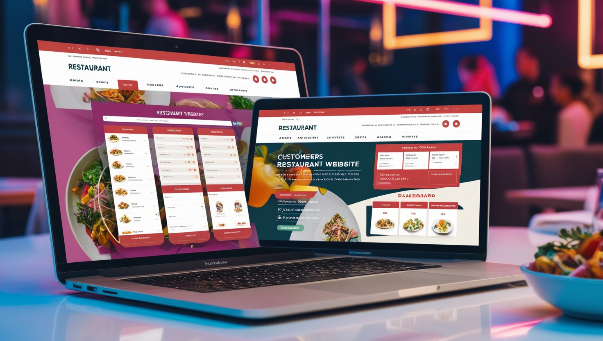

# 🍽️ The Gallery Café - Web Application

A fully functional, feature-rich restaurant website built using <b>PHP</b>, <b>MySQL</b>, <b>JavaScript</b>, <b>HTML5</b>, and <b>CSS3</b>. Designed for a seamless online experience, this web application provides an interactive way for customers to browse the menu, place orders, and reserve tables while also offering robust management functionalities for restaurant staff and administrators.

<br>

## 🌟 Project Overview

The <b>Gallery Café</b> Web Application is a modern, secure, and efficient platform that enhances restaurant operations by integrating user-friendly features. Whether you’re a customer looking to enjoy a meal, an employee managing orders, or an admin overseeing operations, this platform has got you covered!

## 🚀 Features & Functionalities

### 👥 User Authentication

- Secure Login & Signup
- Password Reset with OTP Verification
- Session Security & Auto Logout Mechanism
- User Role Management (Customers, Employees, Admins)

### 🛒 Order & Cart Management

- Add, Remove, and Modify Items in Cart
- Seamless Order Placement & Tracking

### 📅 Reservation System

- Book and Manage Table Reservations
- Instant Confirmation & Notification System

### 📌 Menu Management

- Browse & Search Menu Items with Categories
- Admins & Employees Can Add, Edit, or Remove Items

### ⚙️ Admin & Employee Dashboard

- View and Manage Orders & Reservations
- Track Customer Activity and Generate Reports
- User & Access Management
- Secure Data Storage with MySQL Database

### 🔒 Security Features

- Access Control: Different user roles with restricted access
- CSRF Protection: Secure form submissions
- Session Management: Automatic session expiration & regeneration
- SSL Encryption: Enforce HTTPS connections for secure communication
- Security Headers: Protection against various web vulnerabilities

## ⚙️ Utility and Security Features under the hood

- **Access Control**: Different user roles have restricted access to specific pages.
- **Cross-Site Request Forgery (CSRF) Protection**: Enhanced form security.
- **HTTPS Enforcement**: All traffic is redirected to HTTPS for secure communication.
- **Security Headers**:
  - `X-Content-Type-Options: nosniff`: Prevents browsers from interpreting files as a different MIME type.
  - `X-Frame-Options: DENY`: Prevents the page from being embedded in an iframe.
- **Session Security**:
  - Secure session settings (HTTP-only cookies, secure cookies over HTTPS).
  - Session regeneration every 30 minutes to mitigate session fixation.
  - Session data validation on each request to prevent session hijacking (IP address and user agent checks).
  - Automatic session destruction if mismatched session data is detected.
- **CSRF Tokens**: Forms are secured with CSRF tokens.
- **Secure Logout**: Proper session termination.
- **Error Handling**: Robust error management for a smoother user experience.
- **SSL Certificate**: Ensure a secure connection.

## User types and Functions

### 🏷️ Admin Functions

- **User Management**:
  - Add new users (customers, admins, staff)
  - Manage existing users (employees and customers)
- **Menu Management**:
  - Add, update, and delete menu items
  - Manage menu item categories
- **Order Management**: Oversee both online and in-shop orders.
- **Reservations Management**: Manage customer reservations.
- **Restaurant Management**:
  - Manage tables and their types
  - View order and reservation details

### 🏷️ Employee Functions

- **Menu Management**: Update and manage menu items.
- **Order Management**: Oversee online and in-shop orders.
- **Reservations Management**: Handle customer reservations.
- **Restaurant Management**: Manage restaurant tables.
- **View Information**: Access order and reservation details.

### 🏷️ Customer Functions

- **Ordering**: Place and manage online orders.
- **Reservations**: Book and manage restaurant reservations.
- **Menu Browsing**: View available menu items.

## 🏗️ Installation & Setup

Follow these steps to set up the project on your local server:

1. Clone the repository:

```bash
git clone https://github.com/KevinThulnith/Restaurant-Website.git
```

2. Install Dependencies

Install PHPMailer with Composer

```bash
composer require phpmailer/phpmailer
```

3. Configure SSL Certificates (For Local Development)

View and manage installed SSL certificates on your local server:

```bash
certmgr.msc
```

Generate an SSL Certificate using this guide: 🔗 <a href="https://youtu.be/zrbaE1Wdviw">YouTube tutorial</a>

4. Autoload PHPMailer in Your Code

Import PHPMailer to enable email functionalities:

```bash
use PHPMailer\PHPMailer\PHPMailer;
use PHPMailer\PHPMailer\Exception;

require '../vendor/autoload.php';
require '../vendor/autoload.php';
```

## 🏆 Why Choose This Project?

- ✅ Easy to Use - Intuitive UI/UX for a smooth customer experience.
- ✅ Secure & Scalable - Built with security best practices and scalable architecture.
- ✅ All-in-One Solution - Manages orders, reservations, user roles, and more!
- ✅ Developer-Friendly - Clean code structure with comments and modular components.

## 💡 Future Enhancements

We plan to introduce more exciting features in upcoming updates, including:

- Live Order Tracking 🛵
- AI-Powered Menu Recommendations 🤖
- Loyalty Rewards System 🎁
- Integration with Payment Gateways 💳

## 📝 Contributing

We welcome contributions from the community! Feel free to submit pull requests or report issues to improve the project.

## 💬 Connect with Us

For any questions or suggestions, reach out via issues or discussions in the repository.

Made with ❤️ by Kevin Thulnith
